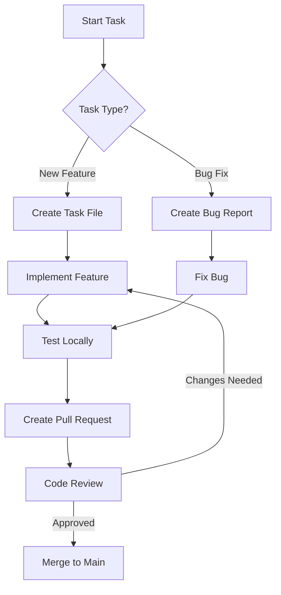

# CHEX Task Management

## Task Naming Convention

### Task ID
- Use sequential numbers (T-001, T-002, etc.)
- Each task gets a unique number
- No specific ranges are enforced

### Task File Location
- Location: `tasks/YYYY-MM-DD/T-XXX_short-description.md`
- Example: `tasks/2025-09-22/T-101_arrakis-terrain.md`

## Task Creation

### Required Fields
1. **Title**: Clear, concise description
2. **Goal**: What needs to be accomplished
3. **Acceptance Criteria**: Specific, testable requirements
4. **Dependencies**: List of blocking tasks
5. **Estimated Time**: Rough time estimate

### Task Template
```markdown
# T-XXX: [Task Title]

**Goal**: [Brief description of what needs to be done]

## Acceptance Criteria
- [ ] Criteria 1
- [ ] Criteria 2
- [ ] Criteria 3

## Dependencies
- [ ] T-YYY: [Dependency 1]
- [ ] T-ZZZ: [Dependency 2]

## Time Estimate
- Estimated: [X] hours
- Actual: [ ] hours

## Notes
- Any additional context or references
```

## Workflow



## Task States

1. **Not Started** - Task is defined but work hasn't begun
2. **In Progress** - Actively being worked on
3. **In Review** - PR created, awaiting review
4. **Completed** - Merged to main
5. **Blocked** - Waiting on dependencies

## Task Tracking

- Update `TASK_TRACKING.md` when task status changes
- Include PR links in task updates
- Note any blockers or issues encountered

## Claiming Tasks

1. Check `TASK_TRACKING.md` for available tasks
2. Run: `bash scripts/spawn_task_branches.sh tasks/YYYY-MM-DD/T-XXX_slug.md`
3. Work on the task in the created branch
4. Create PR when ready for review

## Best Practices

- Keep tasks small and focused
- Break large tasks into subtasks
- Update task status promptly
- Reference related tasks in PRs
- Document decisions in task notes

## PR / Handoff

1. `git status -sb`
2. `git add <files>`
3. `git commit -m "feat: <short description>"`
4. `git push --set-upstream origin feature/<task-id>`
5. Final summary references: task, notes, progress log, `./gradlew check`

## Multi-Agent Coordination

- **Check claims first**: Always verify `claims/<slug>.claim` doesn't exist before starting work
- **Respect active claims**: If a claim exists, coordinate hand-off or choose a different task
- **Communicate conflicts**: If you find conflicting work, document in `notes/` and coordinate
- **Update claims**: Mark tasks as completed by updating the claim file or removing it
- **Clean up**: Remove claim files when tasks are fully completed and merged
- **Never edit claims manually**: Only use the spawn script to create/update claims
- **Verify claims/.gitkeep**: Ensure this file is tracked so fresh clones retain the claims directory

## Do / Don't

- **Do** use `scripts/spawn_task_branches.sh` to claim tasks; do not create feature branches manually
- **Do** check for existing claims before starting any task
- **Do** run Spotless and `./gradlew check` before finishing
- **Do** protect GTCEu fallback behaviour
- **Do** mention unresolved warnings in the final summary
- **Don't** edit `progress/` history in place - append only
- **Don't** merge `master` locally; leave integration to maintainers
- **Don't** assume a task is free without checking for an existing `.claim`
- **Don't** create feature branches without using the spawn script
- **Don't** edit someone else's claim file without coordination

## File Map (quick reference)

- `PROJECT_CONTEXT.md` - architecture & scope
- `CHEX_PROMPT_GUIDE.md` - full working instructions
- `CHEX_DETAILED_TASKS.md` - task matrix (top-to-bottom)
- `tasks/` - task briefs agents reference when claiming
- `claims/` - active task locks; contains `.gitkeep` and individual `.claim` files
- `notes/` - detailed design & intermediate reasoning
- `progress/` - chronological milestone snapshots
- `scripts/setup_dev_env.ps1` - Windows bootstrap (installs hooks)
- `scripts/cloud_bootstrap.sh` - Linux/macOS bootstrap
- `scripts/spawn_task_branches.sh` - branch + claim automation
- `AGENTS.md` - this contract (keep in sync)
